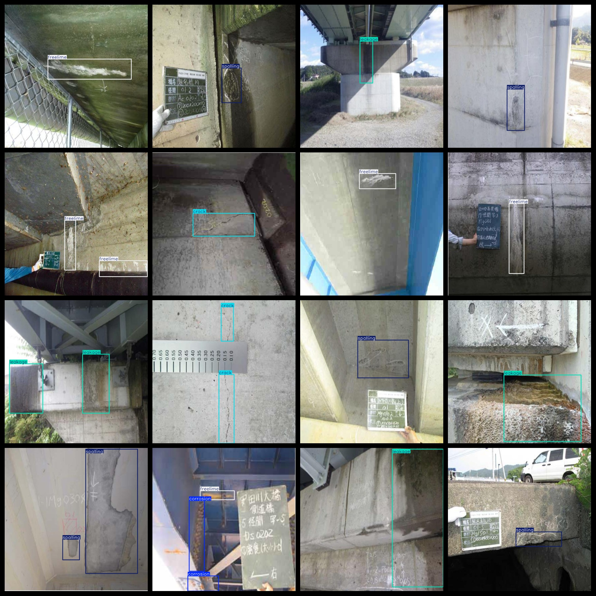
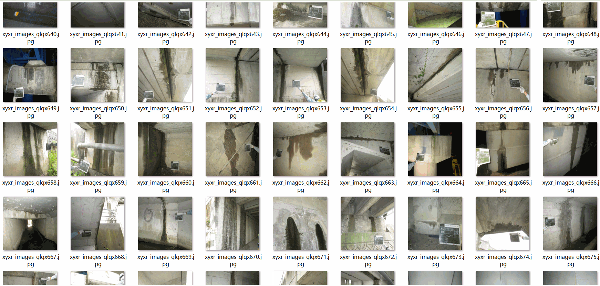

# Bridge Defect Detection Dataset: 3132 images in VOC+YOLO format.

The Bridge Defect Detection Dataset consists of 3132 images in the VOC+YOLO format.

Dataset Format: Pascal VOC format + YOLO format (excluding txt files containing segmentation paths, only including jpg images along with corresponding VOC format xml files and YOLO format txt files)

Number of Images (in jpg format): 3132

Number of Annotations (in xml format): 3132

Number of Annotations (in txt format): 3132

Number of Label Categories: 5

Repository where the dataset is located: datasets_sl

Label category names according to yolo format order but not this one, refer to the labels folder's classes.txt file: ["corrosion", "crack", "freelime", "leakage", "spalling"]

Chinese translation for label categories: corrosion, crack, free lime, leakage, spalling

Box counts for each category:

Corrosion boxes = 780

Crack boxes = 1324

Free lime boxes = 677

Leakage boxes = 619

Spalling boxes = 902

Total box count = 4302

Number of images per category:

Corrosion images = 630

Crack images = 814

Free lime images = 549

Leakage images = 520

Spalling images = 715

Image resolution: 640x640

Annotation tool used: labelImg

Dataset enhancement status: No

Annotation rules: draw rectangular boxes around the categories

Important note: The dataset does not have a division into training, validation, or test sets; you will need to divide it yourself.

Special declaration: This dataset does not guarantee the accuracy of the trained models or weight files.

## Images

---

Here is a pay link on Stripe (https://buy.stripe.com/3cs8yP7sY87d0vu9AB). Please contact me lonlonago@foxmail.com after funding $89, and I will send you a complete data files, thank you!

